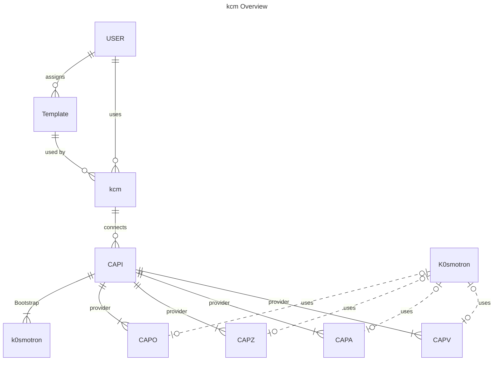

# Architecture

Below is a diagram that provides an overview of how k0rdent works.

## Architectural Overview

```mermaid
---
title: kcm Overview
---
erDiagram
    USER ||--o{ kcm : uses
    USER ||--o{ Template : assigns
    Template ||--o{ kcm : "used by"
    kcm ||--o{ CAPI : connects
    CAPI ||--|{ CAPV : provider
    CAPI ||--|{ CAPA : provider
    CAPI ||--|{ CAPZ : provider
    CAPI ||--|{ CAPO : provider
    CAPI ||--|{ k0smotron : Bootstrap
    K0smotron |o..o| CAPV : uses
    K0smotron |o..o| CAPA : uses
    K0smotron |o..o| CAPZ : uses
    K0smotron |o..o| CAPO : uses
```
